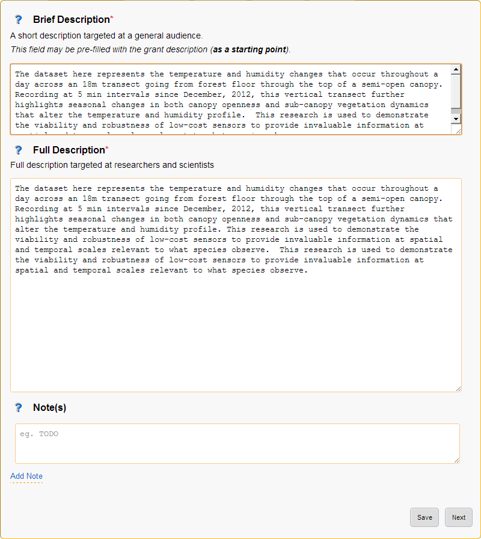
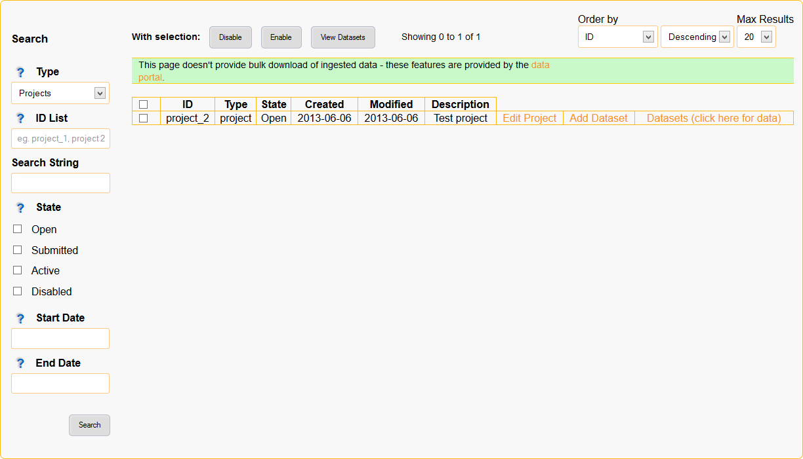

=================
EnMaSSe User Guide
=================

There have been great strides in making it easier to share and re-use research data throughout Australia, and EnMaSSe is a tool that takes it one step further.  EnMaSSe is designed to increase the efficiency of creating and sharing research data, which means quicker progress within Australia as a whole, higher potential for new technologies and a better understanding of our environment.

Think of research data as information scientists & engineers have available for creating new technologies such as mapping how climate change will affect your life in the next 30 years, the latest medical cures or preserving our great Australian environment - almost anything you can think of, the building blocks of our entire modern lifestyle is research!

The EnMaSSe application provides a user-friendly interface for:

- Flexible and scalable research data ingestion (both streamed or manually input).
- High quality, fine grained, project based, metadata creation and export (eg. Enter 1 record, export many).
- Administerable and maintainable project lifecycle and workflows.

Overview
--------

Researchers face many challenges once they decide to share data as there is a large amount of information that must always be attributed to this data in all circumstances of use.  The most obvious of these is data collection methods, but there are other pieces of information that NEED to be passed on with this data, such as all parties involved in data collection (persons and organisations); who owns the data; who manages the data; version of the data; funding sources; licences; whether the data is derived; etc.  EnMaSSe helps researchers to easily attribute this data about data (metadata) to whole projects, whole research methods, and all datasets associated with each project and method (Figure 1).

   
*Figure 1:  EnMaSSe Overview*

The important outcomes of the EnMaSSE system are both:

- High quality information about the data (metadata) describing why it is important and good quality.
- Ingesting the actual data.

Figure 1 above illustrates how external sensors and manual observations are input into EnMaSSe along with the high quality information about the ingested data which is then exported to external systems for persistent storage and publication.

Research Data Australia (RDA) is a national service for publication and sharing of research data, this is the destination for the high quality information about the collected data.

ReDBox-Mint is 3rd party metadata repository (ReDBox) and name authority (Mint) which stores people, grants/activities and services.  ReDBox handles curation (quality assurance and linking related information) and exporting to RDA.

CoastalCOMS Digital Asset Manager CC-DAM is the persistent data storage system used, to put it simply it is a database indexed file storage system which makes it highly scalable (for example our first import contained over 8 million files!).  

*Figure 2: EnMaSSe workflows & components*

Sensor data presents the most obvious example of data that is challenging for researchers to share: many datasets are collected at many locations sometimes with multiple sensor types often across multiple projects.  Yet almost all metadata for a single sensor for a single project will be the same, and often the metadata between projects will be similar.  EnMaSSe recognises this and is structured such that a single unique piece of information should rarely need to be typed more than once (Figure 2).

Metadata Records (ReDBox) Concepts
-----------------------------------

Metadata describes what your data is, who collected, why it was collected and how it can be used by others. Its purpose is to help those who are unfamiliar with the project understand what they are looking at. Even if you are not intending to share your data outside your project group, a metadata record will be useful to your future self - when you need to revisit the research after a long break.

The EnMaSSe application gathers some basic information from you and will automatically create a metadata record for each of your datasets from this.

Templates, grants and pre-fill
++++++++++++++++++++++++++++++

A core focus of the EnMaSSe system has been to reduce the amount of information that needs to be entered and pre fill as much as possible.

To achieve this goal a number of features have been implemented:

- **Project templates** allow administrators to provide projects that have any/all fields already filled, while this is a great feature it has the limitation that most projects will be dissimilar.
- **Method templates** allow administrators to provide method+dataset combinations for known data collection methods.  This will be great for sensors that are commonly used and it is anticipated that this will both save a lot of time and simplify the use of sensors.
- **Standardised fields** allow administrators to provide common data configurations that the end user can select rather than recreating the way the same data is stored all the time.
- **Project creation wizard** allows selection of the project template as well as collecting the primary contacts and (optionally) the associated grant, data is retrieved and used to pre fill fields such as the brief description and project dates.
- **Record citation** are automatically generated from the entered information (administrators have the option to provide a custom citation).
- **Duplicate Project** allows any user to create a new project which is a copy of the currently viewed project.  This is great for similar projects and is more flexible than templates that administrators first need to set up.

How metadata records are generated
++++++++++++++++++++++++++++++++++

When an EnMaSSe project is submitted and approved a metadata record is created for the project itself as well as each individual dataset, each dataset metadata record starts as a copy of the project record then the:

- **Title** is set to <project title> at <location name>(<lat, long, height>) collected by <method name>.
- **Location** is set to the dataset location (each dataset requires a valid location).
- Each dataset is associated with a method, the description entered for the method is added as a **note description**.
- **Publish date** is set as specified on datasets page.
- **Citation** is generated when sent to ReDBox.

If a dataset is required as an intermediary processing step and it doesn’t make sense to create a metadata record, generation for the dataset can be disabled by unchecking the publish metadata record box.

All generated metadata Records link back to EnMaSSe for previewing of the ingested data, for project records this will redirect to the project pages (contextual sidebar options will allow browsing of associated data) and dataset records will redirect to the relevant manage dataset page.

Limitations
+++++++++++

There are a couple of metadata record creation limitations with the current system.

**Records can’t be edited after creation**, this is by design as published records should be persistent.  One use case in support of this is where your data is cited in a publication, if the metadata record was then changed it could invalidate their work.

**Record generation isn’t configurable**, this was out of scope - if specific minor changes are required the administrators may be able to update the record generation.

Data Concepts
-------------

When we talk about research data what we are really talking about is years of work, it is all too common for researchers to store data on their own computers or laptops and it could all be lost with a single hard drive failure!

But not only is data backups and redundancy important, it is also important to make sure the data is stored in a format that makes sense and can be found and used when needed.

This section introduces a number of complications that occur when working with data and provides more information on the concepts behind how to configure data ingestion.

Data Sources
++++++++++++

Data sources are ways of getting data into the system and how that data should be processed to fit the data configuration.

EnMaSSe has been designed to be as flexible as possible by providing generic ways of ingesting data and allowing end users to provide custom python scripts to process the data,

Choose the data source that is easiest for you to use:

- **Web form/manual** data sources simply allow for manual data entry (web form) without any streamed data ingestion.
- **Pull from external file system** data sources ingest data from a folder on a web accissible server, this is a very generic and is anticipated to be the most commonly used data source.
- **SOS data sources** (Sensor Observation Service) provide data ingestion from an external SOS server, all data for every sensor is ingested and it is up to the processing script to retrieve and store the relevant data.
- **Push to this website** allows 3rd parties to develop software tools that integrate directly with the EnMaSSe system, allowing them to provide the data for ingestion however they like.
- **Output from other datasets** allows for chained processing and storage.  Such as the data for many datasets is ingested as a single large file in a ‘parent’ dataset and each ‘child’ dataset then ingests and further processes the data individually.

Data sources aren’t conceptually too difficult they just need to get the data from somewhere and process it to fit the provided data configuration.  

The complicated part is that a custom Python script is needed to do the processing (Requires a developer/programmer), so most users will need to enter a description of their processing needs for the administrators to help with.

Data Configuration
++++++++++++++++++

Data configuration is about storing your data as efficiently as possible and identifying which fields potential users will want to search on.  

The data configuration also sets up a manual data entry form where the custom fields and standardised fields are the fields on that form.

Efficiency & Searching
++++++++++++++++++++++

Think of each data ingestion as being a single file (eg. basic text file that you open in notepad), the custom fields and standardised fields you set up in data configuration are bits of data that you want read from the file and remembered so that they are easy to search.

Basically the less indexes used, the lower the processing and storage overheads, but the whole point is to make the data as reusable as possible so provide indexes on fields that are likely to be searched.

Storage and data configuration has been implemented this way to make EnMaSSe as efficient and scalable as possible, this is necessary as research data grows quite large (eg. our first import was over 8 million data points).

For example, when deciding which fields should be searchable - potential users would almost always search for the location and time (which is why they are compulsory) but they would probably also search on relevant data such as the temperature, it is unlikely that they would search on quality assurance or other minor/associated data though.

Process to work out how to store your data
++++++++++++++++++++++++++++++++++++++++++

While modelling data we want to **store it in a way that makes sense to the researcher**, so that it makes sense to the researcher when it comes time to reuse the data.

**It is good practice to store the original data** as well as the processed data or results, this is both incase the processing had errors and the original data is needed to recover as well as to allow other researchers to re-process the original data in the way they need.

The first step is to think about what data is being collected, how the data is originally stored and what needs to be searchable.

Now identify the different methods that are being used to collect the data, this may include:

- Different ways of collecting data, such as manual observation forms or sensors.
- Different methodology being used for the same data collection method, such as temperature sensors placed under trees vs temperature sensors placed in the sun for measuring the differences.

Each method just identified is a data collection method in the EnMaSSe system, now we need to work out the data configuration for each method.

Now we need to break the data your methods collect up to fit the EnMaSSe data configurations:

#. In most cases the raw data should be stored as a file of some kind so add a custom field of type file (it is good practice to permanently store the raw data for future needs).  One possible exception is when the web form/manual data source is selected.
#. Identify what in your data needs to be searchable.  This will typically be the final, processed result and is generally a common measurement (eg. temperature, weight, humidity) rather than associated information such as quality assurance.  
#. Where available add fields that need to be searchable as standardised data fields section, if there is no applicable standardised field add them as custom fields.

After following this process you should now have your data logically modelled in a fine-grained manner that promotes efficiency of storage, efficiency of searching and the flexibility for researchers to reprocess and/or reuse your data in ways you don’t even anticipate.

Limitations
+++++++++++

There are some limitations with the current EnMaSSe implementation:

- Data is stored as flat files, so indexing (data configuration) needs to be done right from the start - it is possible to reprocess and re-index data, but this shouldn’t be the norm.
- It is likely that users will require new standardised fields and template which requires constant administrator support.
- Standardised fields can only be added once, so if the user has two of the same type of data they will need to add the second as a custom field.  We have since rethought this and it would make more sense for standard measurements such as temperature to be added as custom field types and standardised fields be used as a template like system for data configurations.

Project Creation & Configuration
--------------------------------

EnMaSSe has been designed around projects that may contain many data collection methods and datasets (data collected by the same method at the same location/identifier).  The project structure was chosen to require the minimum amount of data from the user to generate many metadata records and data ingesters (less work for you!).

1. Project Creation
+++++++++++++++++++

The first step is to create a new project (click the New Project item in the main menu), this consists of a creation wizard that pre-fills fields based on the selected project template and the associated research grant as well as collecting the primary contacts.

Project templates allow for pre-filling of any/all fields, and provides the maximum time-savings when there are projects that are similar - equivalent functionality can be achieved using duplicate project in the sidebar.

*Figure 3:  New Project page (Templates are hidden by default)*

Description of Fields
=====================

Use a project template (only select if your project is similar to a previous one)
    Select this checkbox if you would like to use a project template.

    Note:    
        - Project templates are most useful when set up specifically for your department or research group, you can request the administrators to add new project templates.
        - In most cases your supervisor or department will let you know in advance if there is an appropriate template for you to use.

Select a Project Template
    Categories are displayed on the left and templates are on the right.

    First select your category/research group/department on the left side, then select the most appropriate template on the right.

    Note:
        - A template has been selected when it is outlined.

There is an associated research grant
    Un-select this checkbox if your project doesn’t have a research grant.

Research Grant     
    Start typing the title of your research grant, there is a short delay when you stop typing before the list of available grants is shown.

    Note:    
        - If your grant isn’t displayed in the list then please contact the administrators about getting it added to ReDBox-Mint.
        - You must select an item from the autocomplete list, directly entered text will not work.

Data Manager (Primary contact)*
    Start typing the name of the projects data manager, there is a short delay when you stop typing before the list of available people are shown.
    
    Note:    
        - If your primary contact isn’t displayed in the list then please ask them to login to the EnMaSSe system.
        - You must select an item from the autocomplete list, directly entered text will not work.

Project Lead (Supervisor)*
    Start typing the name of the project lead, there is a short delay when you stop typing before the list of available people are shown.

    Note:    
        - If your project lead isn’t displayed in the list then please ask them to login to the EnMaSSe system.
        - You must select an item from the autocomplete list, directly entered text will not work.

2. General Details
++++++++++++++++++

After project creation the general details page is displayed and collects metadata including the title, associated grant and information about all associated people, groups and organisations.

If a research grant was provided in the project creation step:

- Project title is pre-filled with the grant title as a starting point
- Any additional people associated with the research grant are added to the people section.

*Figure 4:  General details page*

Description of Fields
=====================

Project Title*
    Enter a descriptive name for this project, someone that sees the project title should get a general understanding of what the project is about.

    Note:    
        - Metadata records generated for datasets will use the project title in the following pattern:
          <project title> at <location name> (<lat>, <long>, <elevation>m above MSL) collected by <method name>
        - The project title may be pre-filled with the title of the research grant chosen on the project creation page.

Research Grant    
    Start typing the title of your research grant, there is a short delay when you stop typing before the list of available grants is shown.
    
    Note:    
        - If your grant isn’t displayed in the list then please contact the administrators about getting it added to ReDBox-Mint.    
        - You must select an item from the autocomplete list, directly entered text will not work.    
        - This will be pre-filled if a research grant was provided on the project creation page.

People   
    Add all people associated with this project.
    
    Note:    
        - This will be pre-filled with the data manager and project lead.    
        - Due to internal restrictions the project lead is shown as aggregated by.    
        - If a research grant is selected all associated people will be pre-filled in this section.

    This project is
        The relationship that this person has with the project, select the most relevant relationship.
        
    Person
        Start typing the name of the person, there is a short delay when you stop typing before the list of available people are shown.
        
        Note:    
            - If your person isn’t displayed in the list then please ask them to login to the EnMaSSe system.
            - You must select an item from the autocomplete list, directly entered text will not work.
    
Collaborators (Organisations, groups or external people)    
    Add any additional collaborators that cannot be added in the people section such as people, groups or organisations.

3. Descriptions
+++++++++++++++

The descriptions page provides plenty of space to enter the brief and full descriptions of the project as well as optional notes.

Detailed methods used within the project should not be entered in this section.

*Figure 5:  Descriptions page*

Description of Fields
=====================

Brief Description
    Provide a short description of the research done, why the research was done and the collection and research methods used.

    This description should be written in layman's terms and focus on giving an overview of the whole project without going too far into detail about specific methods or datasets.

    Note:    
        - The brief description may be pre-filled with the research grant description, this will need updating.
        - The entered brief description will be used for all generate records, so make sure it makes sense for all methods and datasets that your project will use.

Full Description
    Provide a full description of the project targeted at researchers and scientists (technical details allowed!).

    Note:    
        - The entered full description will be used for all generate records, so make sure it makes sense for all methods and datasets that your project will use.

Note(s)   
    Optionally enter additional notes about the project, this may include things like additional information on funding bodies, high level overview of the project location or any information you want to add to the generated metadata records that doesn’t really fit elsewhere.
    
    Note:    
        - Notes will be used for all generate records, so make sure it makes sense for all methods and datasets that your project will use.

4. Information
++++++++++++++

Collects the bulk of metadata (information about the collected research data) for the ReDBox record such as keywords, research codes, dates, location and other related information.

If a research grant was selected the date from and date to fields will be prefilled (when available).

*Figure:  Information page*

Description of Fields
=====================

Area of Research
    Grouping of fields that categorise what type of project this is.

    Keywords    
        Provide a list of keywords for your project, keywords may be singular words or phrases.   
        
    Fields of Research*
        Select the most appropriate Field of Research (FOR) which is selecting the categories for the methodology used by your project.
    
        To select a Field of Research select the most relevant entry in each of the three dropdown boxes then click the Add Field of Research button on the right side of the last dropdown box.
        
        Note:    
            - It is valid to select a Field of Research after only selecting values for the first two dropdown boxes.
            - You may enter 1-3 Field of Research codes.
            - Field of Research codes are standardised by the Australian and New Zealand Standard Research Classification (ANZSRC)
    
    Socio-Economic Objectives  
        Select the most appropriate Socio-Economic Objective (SEO) codes which is selecting an intended purpose or outcome of the research this project is recording.
        
        To select a Socio-Economic Objective select the most relevant entry in each of the three dropdown boxes then click the Add Field of Research button on the right side of the last dropdown box.
        
        Note:    
            - It is valid to select a Socio-Economic Objective after only selecting values for the first two dropdown boxes.
            - You may enter 1-3 Socio-Economic Objective codes.    
            - Socio-Economic Objective codes are standardised by the Australian and New Zealand Standard Research Classification (ANZSRC)
    
Research Themes
    Select the most appropriate research theme.
    
    Note:    
        - At least one research theme must be selected.

Type of Research Activity
    Select the most appropriate type of research activity for this project:

    - **Pure basic research** is experimental and theoretical work undertaken to acquire new knowledge without looking for long term benefits other than the advancement of knowledge.
    - **Strategic basic research** is experimental and theoretical work undertaken to acquire new knowledge directed into specified broad areas in the expectation of useful discoveries. It provides the broad base of knowledge necessary for the solution of recognised practical problems.
    - **Applied research** is original work undertaken primarily to acquire new knowledge with a specific application in view. It is undertaken either to determine possible uses for the findings of basic research or to determine new ways of achieving some specific and predetermined objectives.
    - **Experimental development** is systematic work, using existing knowledge gained from research or practical experience, that is directed to producing new materials, products or devices, to installing new processes, systems and services, or to improving substantially those already produced or installed.

    Note:    
        - 1297.0 Australian Standard Research Classification (ANZSRC) 2008.

Project Date and Location  
    Grouping of date and location fields which is sometimes referred to as coverage.    

    Time Period (description)    
        Provide a textual representation of the time period such as 'world war 2' or more information on the time within the dates provided.    
    
        Date data started/will start being collected*
    
        The date that data started being collected.
        
        Note:    
            - This is the actual data date not the finding date, recording date or other date. For example, an old letter may be found in 2013 but it was actually written in 1900 - the date to use is 1900.
    
    Date data stopped/will stop being collected     
        The date that data will stop being collected.
        
        Note:    
            - This is the actual data date not the finding date, recording date or other date. For example, an old letter may be found in 2013 but it was actually written in 1900 - the date to use is 1900.
    
    Location
        Provide the locations of this project, many locations may be entered as points, lines or polygons.
    
        Locations can be added, edited or deleted using the controls in the top right corner of the map: 
        
        - |navigate| Navigate or drag the map to the desired location.
        - |polygon| Draw a polygon (shape with any number of sides) of any shape. 
        - |line| Draw a line which may have multiple line segments.
        - |rectangle| Draw a rectangle (click and drag rather than clicking on each point). 
        - |point| Draw a single point. 
        - |move| Move points, this may be actual points or vertices of polygons and lines. 
        - |delete| Delete a location, this has the same effect as pressing the X.
        
        .. |navigate| image:: _static/map-navigate.png
        .. |polygon| image:: _static/map-polygon.png
        .. |line| image:: _static/map-line.png
        .. |rectangle| image:: _static/map-rectangle.png
        .. |point| image:: _static/map-point.png
        .. |move| image:: _static/map-move.png
        .. |delete| image:: _static/map-delete.png

        Name        
            The name of the entered location, most research projects will have a code or name for each location such as Australian Wet Tropics or CU42A.
        
        Location        
            Actual location formated in the WTK standard.
        
            Note:    
                - If you want to enter a location manually as text it may be easier to add the location using the map first and edit the text that is provided.
    
        Elevation
            Optionally, enter the elevation as meters above mean sea level (MSL).
            
            Note:    
                - The entered elevation won’t be used in exported metadata records.
    
Licenses & Access Rights
    Contains fields associated with licensing, getting access to the data and how the data can be used.

    Access Rights     
        Select how interested 3rd parties can go about gaining access to the projects data.
    
    License
        Select the most appropriate license from the list, if you require a different license please let the administrators know so they can add it for you when approving the project.

Retention period
    Record the period of time that the data must be kept in line with institutional or funding body policies.

Related Publications     
    Provide details on any publications that are related to this project including their title and URL with an optional note.

Related Websites     
    Provide details on any websites that are related to this project including their title and URL with an optional note.

Attachments (Uploading to ReDBox isn't supported at this time)     
    Optionally provide additional information as attachments.

    Note:
        - This should be added to all generated records but at the time of writing it is a limitation of the EnMaSSe integration with ReDBox.

5. Methods
++++++++++

The methods page sets up ways of collecting data (data sources), what the data is or its type (data configuration) as well as collecting the methods name (used to generate record titles of associated datasets) and description of the detailed methodology (added as a note description to records).

Adding methods uses a simple wizard that allows selection of a method template. Method templates pre-fill any/all data in methods and their associated datasets.

The type of data being collected allows configuration of what data is collected and how that data is indexed:

- Most methods will store raw data as a file and index specific information so it is searchable.
- Standardised fields are provided for common data types (eg. temperature, humidity, etc).
- Using the standardised fields will make the indexed data searchable globally within the data storage.
- Data configuration allows full configuration of the data types as well as how to display the fields in a web form.

Selection of the data source specifies how data will be ingested but configuration of the data source is done in the datasets step.

*Figure 6:  Methods page*

Description of Fields
=====================

Method Name
    Provide a short, descriptive name for this method of collecting data.

    The entered name will be used in the generated dataset record as:    
        <project title> at <location name>(<lat, long, height>) collected by <method name>
    
    The name and description will also be used to identify the method used in the datasets step.

Description
    Provide a description of this method, this should include what, why and how the data is being collected.
    
    Note:    
        - The entered description will be added as note descriptions to the metadata records associated with this method.
        - Don't enter where or when as this information is relevant to the dataset, not the method.

Data Source (How the data gets transferred into this system)
    Select the way you would like to ingest data for your project.

    'Web form/manual' is the default (other data sources also allow adding data through a web form), 'Output from other dataset' provides advanced processing features and the other three methods allow automatic ingestion from compatible sensors or services:
        
    - **Web form/manual only:** Only use an online form accessible through this interface to manually upload data (No configuration required).
    - **Pull from external file system:** Setup automatic polling of an external file system from a URL location, when new files of the correct type and naming convention are found they are ingested (Configuration required on datasets page).
    - **(Advanced) Push to this website through the API:** Use the XMLRPC API to directly push data into persistent storage, on project acceptance you will be emailed your API key and instructions (No configuration required).
    - **Sensor Observation Service:** Set-up a sensor that implements the Sensor Observation Service (SOS) to push data into this systems SOS server (Configuration required on datasets page).
    - **(Advanced) Output from other dataset:** Output from other dataset: This allows for advanced/chained processing of data, where the results of another dataset can be further processed and stored as required (Configuration required on datasets page).

    Note:    
        - It will be possible to change the data source once the project has been submitted and approved.    
        - Refer to the Data Concepts section for a more indepth explanation of data sources. 

Data Configuration  
    Data configurations setup how ingested data will be stored and what data will be searchable.

    Note:    
        - Refer to the Data Concepts section for a more indepth explanation of data configuration.       
        - Data configuration cannot change once the project is submitted and approved.    

    Standardised data fields (Recommended where possible)
        Standardised fields allow you to extend commonly used data configurations, this makes it both easier for you and collects more uniform data (which makes it easier to search).
        
        Select the type of data you want to use and click the Add Standard Data Field button.
        
        Note:    
            - It is a current limitation that you can only each type of standardised field once.
        
    Custom Fields
        Each custom field adds an indexed (searchable) field to your data configuration.
        
        Add additional custom fields by clicking the Add Custom Field at the bottom of the list of custom fields.
        
        Note:    
            - It is highly recommended that you refer to the Data Concepts section.
    
        Name    
            Provide a name for your field.
        
        Description
            Describe to other users what the purpose of this field is.
        
        Field Type
            Select what type of data this field represents.
        
        Units (Integer, Decimal)
            Enter the units for this field, this will sometimes be not applicable and you can leave it blank.
        
        Mime Type (File)
            Provide a mime type for your file (eg. text/json)
        
        Example (Single line text, Multi line text)
            Provide an example of the sort of text expected.
        
        Default Value (All)
            Enter a default value, this will be the value used if no value is given.
        
        List of Values (Dropdown box, multiple choice)    
            Provide a comma-separated list of options (eg. Red, Blue, Green)
        
        Admin Notes (All)   
            If you need help from the administrators provide a description of your requirements for this field.

Attachment (Such as datasheets, collection processes, observation forms)      
    Attach files that provide more information on your data collection method.  For example, this may include data sheets for sensors used or in-depth detail on the methodology or calibration methods used.

    To add an attachment:
    
    - Click on the browse button.
    - Find the file on your local computer.
    - Click the open button.

Further information website (Such as manufacturers website or supporting web resources)
    Provide information on any websites that describe your data collection method, this is similar to attachments but provide website links instead of the file itself.

    Title
        Provide a name for the linked website.
    
    URL
        Enter the website address.
    
    Notes
        Optionally add a note about why the website was linked to.

6. Datasets
+++++++++++

Each dataset represents an individual collection of data with an associated metadata record (metadata record generation can be disabled).

Adding datasets uses a simple wizard where the data collection method is selected as shown in figure 7 below.

The dataset page collects the following data:

- Whether to create a metadata record and when the record should be published.
- Location of the data, the location may be a set location or an offset from a location where that is more relevent. For example it is more relevent that the sensor shown is 1m from the base of the artificial tree.
- Configuration of the data source.

Each data source is configured differently but will usually require the data location, when to sample and how to process the found data.

*Figure X:  Datasets page.*

Description of Fields
=====================

Publish Metadata Record (Publicly advertise that this data exists)  
    Un-select this checkbox if the dataset shouldn’t export a metadata record.  This option has been provided tentatively as there are some valid reasons to not create records such as:

    - Testing or administration purposes.
    - Datasets that use a dataset data source for intermediary processing and the created data isn’t a usable end result.

    Note:    
        - We would like to encourage as many datasets be published as possible (this is the purpose of the EnMaSSe system!).

Date to publish
    When should this metadata record be published?  Update the publish date if it shouldn’t be published right away.
    
    Note:    
        - The publish date will be pre-filled to todays date.    
        - If the publish metadata record is un-selected this field will be hidden.

Location
    Provide the location of this dataset, only one point location may be entered.

    Controls for adding points or navigating the map are located at the top right corner of the map: 

    - |navigate| Navigate or drag the map to the desired location. 
    - |point| Draw a single point.
    
    Name    
        The name of the entered location, most research projects will have a code or name for each location such as Australian Wet Tropics or CU42A.

    Location    
        Actual location formated in the WTK standard.
    
        Note:    
            - If you want to enter a location manually as text it may be easier to add the location using the map first and edit the text that is provided.

    Elevation
        Optionally, enter the elevation as meters above mean sea level (MSL).
        
        Note:
            - Dataset location will be pre-filled to the project location if the project had a valid point location before the dataset is created.
            - The entered elevation won’t be used in exported metadata records but it will be used in the record title.

Location Offset (optional)      
    Providing a location offset means that the actual location used will be offset from the location entered above.

    This may seem odd but it is useful where the important information is the distance from somewhere rather than the actual point on earth.  
    
    For example, you may have many sensors spaced around a central point - it would then make sense to enter the project location at the centre and set each dataset to offset from that location.
    
    Latitude Offset (meters)    
        How far the location latitude should be offset in meters, this can be positive or negative.
    
    Longitude Offset (meters)    
        How far the location longitude should be offset in meters, this can be positive or negative.
    
    Elevation Offset (meters)
        How far the location height above mean sea level should be offset in meters, this can be positive or negative.
  
7. Submit
+++++++++

Submit provides full project validation and an overview of the generated records and data ingesters. The project has four states:

- Open - The initial state when a project is created, the creator and administrators have read/write access. The creator can also share permissions with other users.
- Submitted - When the project is submitted by the creator it is ready to be reviewed by the administrators and either approved or reopened. A project can only be submitted when there are no validation errors. In the submitted state creators have read access and administrators have read/write access.
- Approved - When an administrator approves the project:
    - Metadata records are exported to ReDBox.
    - Data ingesters are configured and started.
    - The project can no longer be modified, the creator and administrators only have read access.
- Disabled - This state represents the end of the project, when an administrator disables an approved project it disables all ingesters (no more data will be ingested).

The generated record for each dataset can be viewed, edited or reset. Viewing a dataset record is exactly the same as general details, descriptions and information all on a single form.

*Figure 7:  Submit page.*

Description of Fields
=====================

Validation
    The validation section lists all errors that need to be fixed before the project can continue on to the next step.
    
    The submit and approve buttons will be hidden if there are any validation errors.
    
    Validation errors are categorised per page, giving the name of the field and the error message.  

Summary of Datasets & Records
    Provides a quick overview of all datasets in the project along with:

    - Link to their data management page.
    - Link to exported metadata records (if the project has already been approved).
    - Link to create and/or view the metadata that will be exported.
    - Option to reset all modifications to that specific datasets metadata.

Project Notes
    Add notes to the project, these will be visible to everyone with view access and are a simple way of communicating between administrators and users.

Managing & Searching Data
-------------------------

Projects, datasets and data can be searched and edited through the Browse Data page (accessed through the Browse Data menu item along the top):

- You can specify your search criteria in the left hand sidebar, this includes the search type, ID list, string/keywords, state and dates.  Each search criteria further filters the results.
- The buttons along the top of the page alow you to perform actions on multiple search results (eg. enable all selected datasets).
- The dropdown/multi-select boxes along the top-right allow you to order your search results.
- Each result can be selected by clicking the checkbox on it's left.
- Each search result has actions on the right hand side.

*Figure 8:  Screenshot of the browse data page wich provides data management and searching features.*

Project Lifecycle
-----------------

*Figure 9:  Project life cycle*

Projects in the EnMaSSe system follow the life cycle illustrated in figure X above, generally you will only need to submit the project for administrator approval, but the whole process has been illustrated here for completeness.

Open
++++

The open state is for initial setup of the project including all configurations ready to create metadata records and setup data ingestion.  

Once the project has been fully configured the user should go to the submit page to and click the submit button to indicate that the project is ready for administrator approval.

Permitted
=========

Creator, administrators and users that have been given share permissions can edit the full configuration of the project.

Not permitted
=============

Nobody can view logs, enter data or access any data management as the project hasn’t been activated yet.

Submitted
+++++++++

The submitted state is for administrators to check the project configurations are correct and the project is ready to be approved for metadata record generation and data ingestion set up.

Once the administrator has checked that the configurations are correct they should press the approve button on the submit page.  Pressing the approve button starts the metadata record generation and export as well as setting up and starting the data ingesters.

If the administrator requires the creator to update the configurations they should press the reopen button on the submit page.

Permitted
=========

Administrators can edit the full configuration of the project.

Not permitted
=============

Nobody can view logs, enter data or access any data management as the project hasn’t been activated yet.

Non-administrators cannot edit anything.

Active
++++++

An active project has had all metadata records generated and exported and the data ingesters are currently running.

Once a project has come to the end of its life either the project creator, administrator or user with adequate permission shared should press the disable button on the submit page.  Pressing the disable button will deactivate data ingestion, all data and metadata records will be maintained.

Permitted
=========

The project creator, administrators and users with shared permissions can access the data maintenance sections which allow adding/editing of data and limited updating of ingesters.

Not permitted
=============

Project configurations can no longer be edited by anyone.

Disabled
++++++++

The disabled state is where the project is finished but all data and metadata records are persisted.

If the project needs to be re-activated (there is more data to ingest) the re-enable button on the submit page should be pressed by the creator, administrator or other user with adequate shared permissions.

If this is a project that was set up wrong to begin with and has no valid data, the super administrator can delete it.  Once the project is deleted it cannot be recovered, this functionality is only intended for administration and cleanup purposes and would never be used in an ideal world.

Permitted
=========

The project creator, administrators and users with shared permissions can access the data maintenance sections which allow adding/editing of data and limited updating of ingesters.

Not permitted
=============

Project configurations can no longer be edited by anyone.

Permissions & Sharing
---------------------

When on a project page there is a sharing option in the left hand contextual options menu which allows the project creator (or administrators) to give other users permissions for on the currently viewed project:

- **View** allows the user to view project configurations.
- **Edit** allows the user to view and edit the project configurations.
- **Submit** allows the user to press the submit button requesting administrator approval.
- *Disable** allows the user to press the disable button to deactivate data ingestion.
- **Re-enable** allows the user to press the re-enable button to reactivate data ingestion.
- **View Data** allows users to view ingested data.
- **Manage Data** allows the user to view and edit ingested data.
- **Manage Ingesters** allows the user to update ingester configurations (eg. how ingested data is processed).

**Note:**  Users must be within the EnMaSSe system before permissions can be shared with them.  If  you cannot find the user you are looking for, ask them to login and then they should be available.

Dataset Event Logs
------------------

When on a project page there is a view logs option in the left hand contextual options menu which allows the user to see any error messages or state changes of the data ingestion.

By default all logs for all datasets will be displayed as they are loaded, you can provide filtering options or click on the link to see only logs for the selected dataset.

Log filtering options include:

- **Log level** which is the category or type of message such as error or information.
- **Start date** is the date of the earliest logs to show.
- **End date** is the date of the last logs to show.

   
   
