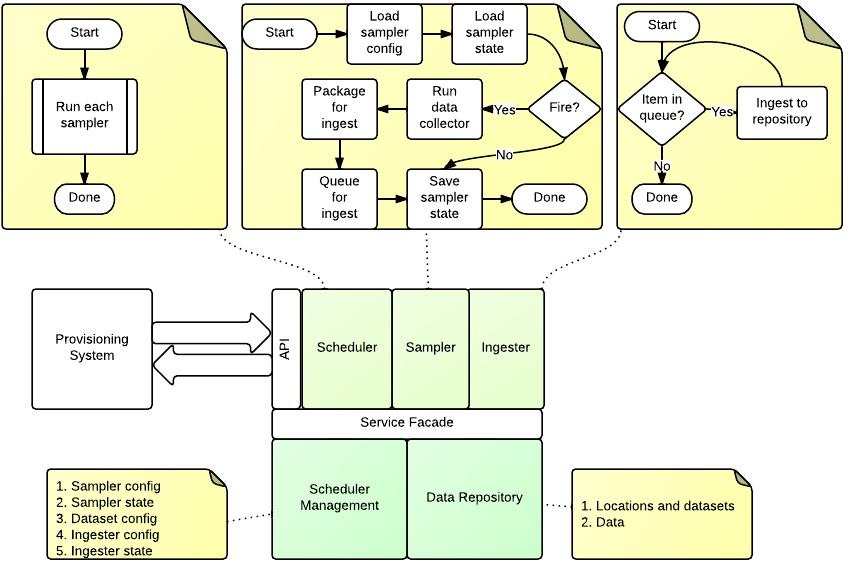

=================
Ingester Platform
=================

--------------
Domain Objects
--------------

The domain of the ingester platform is that of the projects, schemas, datasets, and ingester configurations that are to be collected.

^^^^^^^^^^^^^^^^^^^^^^^^
Project Metadata: Region
^^^^^^^^^^^^^^^^^^^^^^^^
Not implemented

This represents a 2D area of the Earth's surface.

^^^^^^^^^^^^^^^^^^^^^^^^^^
Project Metadata: Location
^^^^^^^^^^^^^^^^^^^^^^^^^^

This represents a point on the Earth's surface. The point has an elevation above MSL, and optionally be part of a region.

^^^^^^^^^^^^^^^^^^^^^^^^
Project Metadata: Schema
^^^^^^^^^^^^^^^^^^^^^^^^ 

Describes the fields that can be part of a metadata entry. The currently supported datatypes are:
* File
* String
* Integer
* Double
* Timestamp

Schemas support multiple inheritance, but all fields must be unique within the schema hierarchy. It is expected that you can search any schema, including base schemas, so any repository implementation will need to take this into account.

^^^^^^^^^^^^^^^^^^^^^^^^^
Project Metadata: Dataset
^^^^^^^^^^^^^^^^^^^^^^^^^

A dataset represents a collection of data entrys at a particular location, that conform to a particular schema. Optionally they will include a data source and sampler to populate them. The location is considered to be the frame of reference for the dataset. Additional metadata may be applied to the dataset to convey specific location information.

^^^^^^^^^^^^^^^^^^^^^^^^^^^^^^^
Ingester Metadata: Data Sources
^^^^^^^^^^^^^^^^^^^^^^^^^^^^^^^

Data sources retrieve data from a remote source, and processes it to a data entry for ingestion into the repository.

**URL Pull Data Source**

This data source pulls a single resource from a specified URL (File, FTP, HTTP) and attaches it to the specified field of a new data entry. In the case of HTTP the Last-Modified header is used as the data entry timestamp. This will map the retrieved file to one specific field and produce one data entry.

**Dataset Data Source**

Gets data from another dataset in the repository. Will download the data from the data entry. By default no data entry is produced.

^^^^^^^^^^^^^^^^^^^^^^^^^^^
Ingester Metadata: Samplers
^^^^^^^^^^^^^^^^^^^^^^^^^^^

Samplers control when an ingestion event occurs in the case of a pull ingestion.

**Periodic Sampler**

The periodic sampler fires at a predetermined rate, specified in seconds.

**New Data Sampler**

Triggers whenever there is new data in another dataset. Passes the data entry ID and dataset as metadata to the data source. Only used with Dataset Data Source.

---------------------------
Ingester Service Components
---------------------------

The ingester platform is build using the http://twistedmatrix.com/ framework, which is a reactor framework. This means that requests and services started using periodic schedulers are serviced by a single thread. This has scaling implications as blocking processes such as ingesting large amounts of data will affect API clients. To overcome this the Ingester Platform has two services threads: the data source service; and the ingester service. Both are part of the IngesterEngine class.

The data source service is fed through a queue by the processSampler method. The the running state of the data source is recorded to prevent multiple concurrent copies of a data source running. Once the data is collected and processed it is placed in an ingest queue.

The ingester service thread is fed from the ingest queue.

^^^^^^^^^^^^^^^^^^^^^^^^^^^^^
processSamplers - Main thread
^^^^^^^^^^^^^^^^^^^^^^^^^^^^^
This method is called periodicly from the Twisted callback. Its purpose is to datasets that are ready to ingest.
 #. Load active datasets
 #. For each sampler
  #. Skip if there is no sampler or if the ingester is running
  #. Load sampler state (processSampler)
  #. Run sampler
  #. Persist sampler state
  #. Queue dataset if sampler returned True

^^^^^^^^^^^^^^^^^^^^^^^^^^^^^^^^^
processQueue - Data source thread
^^^^^^^^^^^^^^^^^^^^^^^^^^^^^^^^^
This reads the dataset queue for new ingesters to run. It relies on the data source always returning or timing itself out.
 #. Load data source state
 #. Create temperary directories
 #. Run data source
 #. If there is a post processing script run it
 #. Queue output data for ingest
 #. Persist data source state

^^^^^^^^^^^^^^^^^^^^^^^^^^^^^^^^^^
processIngestQueue - Ingest thread
^^^^^^^^^^^^^^^^^^^^^^^^^^^^^^^^^^
This thread ingests data into the repository. It relies on the repository access being thread safe.
 #. For each data entry
  #. Ingest into repository

===========
Ingesters
===========

An ingester is an object that is invoked by the ingester platform to assemble zero or more Data Entries. Each
ingester will need a domain object in the ``jcudc24ingesterapi.models.data_sources`` module, and an implementation
in the ``dc24_ingester_platform.ingester.data_sources`` module. The domain object will need to have each of the
valid configuration parameters as Python properties, or our ``typed`` properties.

-----------------------------
Testing from the command line
-----------------------------

To test an ingester you can run it from the command line. To do this you will need to create a config file, 
a working directory, and then invoke it using the ``run_ingester <config> <cwd> [script]`` script. The script takes 2 manditory 
arguments, and one optional argument. These are
 * An ingester config file
 * A working directory
 * And optionally, a post processing script.

A sample config is ::

   {
      "class":"pull_data_source",
       "state":{},
       "parameters":{},
       "config":{"url":"http://www.abc.net.au","field":"page"}
   }

Then, to run you could call: ``run_ingester pull.json /tmp`` then you should see an output such as ::

   Initial results
   ---------------
   Time: 2012-12-19T22:52:42.000Z Dataset: None
   	file = FileObject(f_path: outputfile0, mime_type: )
   
   Time: 2012-12-19T22:56:32.000Z Dataset: None
   	file = FileObject(f_path: outputfile1, mime_type: )
   
   
   ...
   Processed results
   -----------------
   Time: 2013-02-06T10:32:04.493Z Dataset: None
   	temp = 29.9375
   
   Time: 2013-02-06T10:32:04.493Z Dataset: None
   	temp = 29.75

   ...

================================
Ingester Post Processing Scripts
================================

A post processing script is called with a workspace directory (cwd), and
the data entry object that is being processed. The returned data entries
are those which will be actully ingested into the dataset::

   from jcudc24ingesterapi.models.data_entry import DataEntry, FileObject

   def process(cwd, data_entry):
       data_entry = data_entry[0]
       ret = []
       with open(os.path.join(cwd, data_entry["file1"].f_path)) as f:
           for l in f.readlines():
               l = l.strip().split(",")
               if len(l) != 2: continue
               new_data_entry = DataEntry(timestamp=datetime.datetime.now())
               new_data_entry["a"] = FileObject(f_path=l[1].strip())
               ret.append( new_data_entry )
       return ret

================
Search Interface
================

A search will return a specific object type, based on a set of criteria that may reference other related objects. Complex searches could be constructed using using a search tree marshalled to a prefix notation, and then used to generate the search queries. Complex situations may arise when crossing between ingester and repository objects.

======================
Repository Integration
======================

The ingester platform requires a repository in which to store the data that it processes. The repository gets notified when any action occurs on project metdata with an opportunity to store references back in the ingester platform database. The repository is also exclusively used for the storage of data. It is expected to support at least data storage and retrieval methods.

---------------
DAM Integration
---------------
The DAM is the preferred repository for the ingester platform. May of the project metadata object map directly to the DAM metadata objects. If only value criteria are allowed, then this could be resolved by first querying one system then the other. Initially only a subset of the attributes will be searchable.

================ ============
Project Metadata DAM Metadata
================ ============
Region           -
Location         Location
Schema           Schema
Dataset          Dataset
DataEntry        Observation
================ ============

==============
Management API
==============

The EnMaSSe Ingester Platform has no specific user interface of its own, rather, all interactions occur using the web services API. The API provides methods for creating and managing all domain objects, and processes.

-------------------
Object Manipulation
-------------------

--------------------
Management Processes
--------------------

The main purpose of the EnMaSSe Ingester Platform is to manage data ingestion. The following methods enable this.

^^^^^^^^^^^^^^^^
Enable Ingestion
^^^^^^^^^^^^^^^^

::

    enableDataset(dataset_id)

^^^^^^^^^^^^^^^^^
Disable Ingestion
^^^^^^^^^^^^^^^^^

::

    disableDataset(dataset_id)

^^^^^^^^^^^^^^^^^^^^^^
Reprocess Derived Data
^^^^^^^^^^^^^^^^^^^^^^

::

    runIngester(dataset_id)

It is possible to manually trigger an ingestion of *derived data* in the situation where there is a *raw data dataset*, containing data files, and a *derived dataset* that uses the *raw data dataset* as a dataset data source. This has the caviet that if there is already data in the *derived dataset* then invoking this process may create duplicate data entries.

^^^^^^^^^^^^^^^^^^^^^
Retrieve Ingester Log
^^^^^^^^^^^^^^^^^^^^^

::

    getIngesterEvents(dataset_id)

This method is used for retrieving all the available ingester logs. These can give insight into if any why an ingester process is failing.
