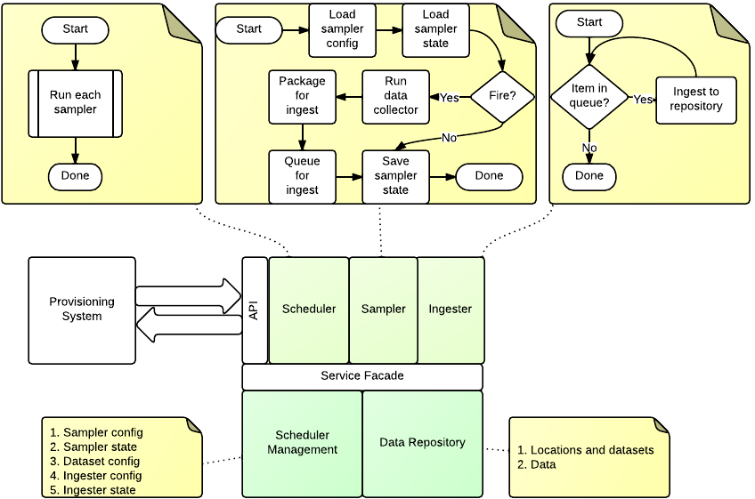

=================
Ingester Platform
=================

--------------
Domain Objects
--------------

The domain of the ingester platform is that of the projects, schemas, datasets, and ingester configurations that are to be collected.

^^^^^^^^^^^^^^^^^^^^^^^^
Project Metadata: Region
^^^^^^^^^^^^^^^^^^^^^^^^
Not implemented

This represents a 2D area of the Earth's surface.

^^^^^^^^^^^^^^^^^^^^^^^^^^
Project Metadata: Location
^^^^^^^^^^^^^^^^^^^^^^^^^^

This represents a point on the Earth's surface. The point has an elevation above MSL, and optionally be part of a region.

^^^^^^^^^^^^^^^^^^^^^^^^
Project Metadata: Schema
^^^^^^^^^^^^^^^^^^^^^^^^ 

Describes the fields that can be part of a metadata entry. The currently supported datatypes are:
* File
* String
* Integer
* Double
* Timestamp

Schemas support multiple inheritance, but all fields must be unique within the schema hierarchy. It is expected that you can search any schema, including base schemas, so any repository implementation will need to take this into account.

^^^^^^^^^^^^^^^^^^^^^^^^^
Project Metadata: Dataset
^^^^^^^^^^^^^^^^^^^^^^^^^

A dataset represents a collection of data entrys at a particular location, that conform to a particular schema. Optionally they will include a data source and sampler to populate them. The location is considered to be the frame of reference for the dataset. Additional metadata may be applied to the dataset to convey specific location information.

^^^^^^^^^^^^^^^^^^^^^^^^^^^^^^^
Ingester Metadata: Data Sources
^^^^^^^^^^^^^^^^^^^^^^^^^^^^^^^

Data sources retrieve data from a remote source, and processes it to a data entry for ingestion into the repository.

**URL Pull Data Source**

This data source pulls a single resource from a specified URL (File, FTP, HTTP) and attaches it to the specified field of a new data entry. In the case of HTTP the Last-Modified header is used as the data entry timestamp. This will map the retrieved file to one specific field and produce one data entry.

**Dataset Data Source**

Gets data from another dataset in the repository. Will download the data from the observation. By default no data entry is produced.

^^^^^^^^^^^^^^^^^^^^^^^^^^^
Ingester Metadata: Samplers
^^^^^^^^^^^^^^^^^^^^^^^^^^^

Samplers control when an ingestion event occurs in the case of a pull ingestion.

**Periodic Sampler**

The periodic sampler fires at a predetermined rate, specified in seconds.

**New Data Sampler**

Triggers whenever there is new data in another dataset. Passes the data entry ID and dataset as metadata to the data source. Only used with Dataset Data Source.

===========
Ingester Post Processing Scripts
===========

A post processing script is called with a workspace directory (cwd), and
the data entry object that is being processed. The returned data entries
are those which will be actully ingested into the dataset::

  import os
  import datetime
  from dc24_ingester_platform.utils import *

  def process(cwd, data_entry):
      data_entry = data_entry[0]
      ret = [data_entry]
      with open(os.path.join(cwd, data_entry["file1"].f_path)) as f:
          for l in f.readlines():
              l = l.strip().split(",")
              if len(l) != 2: continue
              ret.append( {"timestamp":format_timestamp(datetime.datetime.now()), "a":{"path":l[1].strip()}} )
      return ret

